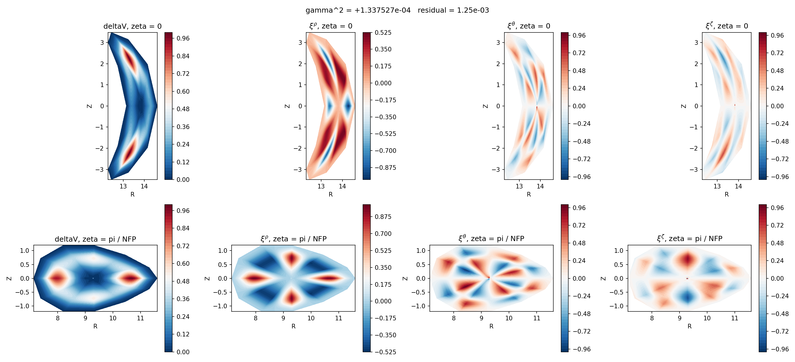
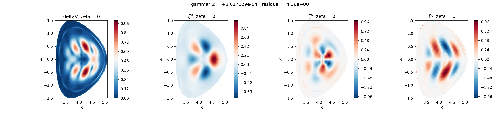
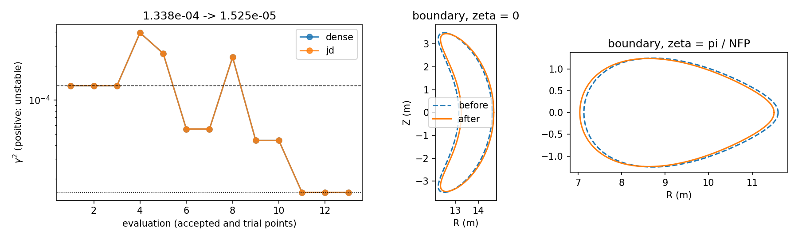

# Examples

Six scripts in `examples/`, each standalone with its settings at the top. Run
them from the repository root. The numbers and figures below are their measured
output: the first four on a CPU (login node of an HPC system, jax 0.6.2), the
optimization on one A100.

| script | needs | shows |
|---|---|---|
| `growth_rate.py` | nothing | one growth rate from a saved `EquilibriumData` |
| `cross_sections.py` | matplotlib | eigenfunction cross sections of a stellarator and a tokamak |
| `basis_comparison.py` | nothing | the convergence of the radial bases (paper, Fig. 7) |
| `optimization_step.py` | nothing | solve mode against optimize mode: one gradient step |
| `matrix_free_solve.py` | nothing | the matrix-free operator and the ring preconditioner |
| `desc_optimization.py` | DESC, a GPU | three optimizer steps through DESC with `AgniStability` |

## A growth rate: `growth_rate.py`

```bash
python examples/growth_rate.py
```

Loads `tests/data/qh_lowres_24x12x8.npz`, the shipped QH case (one field period,
`NFP = 4`), builds the basis its export recorded (Legendre-Lobatto through the
staircase map), and solves with the default `eigsh` (36 s on a CPU):

```
loaded qh_lowres_24x12x8.npz: (24, 12, 8) nodes, NFP=4
gamma^2           +1.3376268705e-04
Rayleigh residual 5.580e-06
eigenvector       6720 retained degrees of freedom

verdict: UNSTABLE
         |gamma^2| / 1e-10 = 1.34e+06 (needs to be >> 1)
```

## Eigenfunctions: `cross_sections.py`

```bash
python examples/cross_sections.py            # both cases
python examples/cross_sections.py DSHAPE     # one
```

Two cases in `examples/data`, exported by `tools/export_desc_example.py` (the
command is in each `.json` sidecar), solved with the dense solver and drawn in
the `(R, Z)` plane: `deltaV` and the three displacement components, the
stellarator at `zeta = 0` and `pi / NFP`, the tokamak at `zeta = 0`.

| case | basis | grid | `gamma^2` | recorded |
|---|---|---|---|---|
| modified LBD QH | Legendre-Lobatto, `x_0 = 0.65` | 24x12x8, one field period | 1.337527e-4 (residual 1.3e-3) | 1.337527e-4 (7e-10 apart) |
| modified DSHAPE, `n = 3` | coupled Zernike-Fourier, `M = 12`, penalty 0.02 | 64x48x1, one plane | 2.617129e-4 (residual 4.4) | 2.617152e-4 (9e-6 apart) |





## Radial bases: `basis_comparison.py`

```bash
python examples/basis_comparison.py
```

Differentiates `rho^4 exp(-20 (rho - 0.4)^2) (sin 3 theta + sin 4 theta) cos 5 zeta`
with each radial basis and reports the sup-norm error against the exact
derivative as `n_rho` grows (35 s on a CPU):

```
 n_rho    legendre-lobatto        radau-jacobi            b-spline   finite-difference
    16           5.985e-03           1.724e-02           4.031e-03           1.157e-02
    24           2.599e-04           5.350e-04           2.173e-03           4.547e-03
    32           1.933e-06           9.649e-06           4.487e-04           2.330e-03
    48           2.524e-10           1.515e-09           4.756e-05           9.303e-04
    64           1.295e-14           9.586e-14           1.417e-05           4.940e-04
    96           5.052e-15           5.684e-14           2.197e-06           2.068e-04
```

## One gradient step: `optimization_step.py`

```bash
python examples/optimization_step.py
```

Solve mode (`growth_rate`, not differentiable: `jax.grad` raises) against
optimize mode (`growth_rate_of` over a `params -> EquilibriumData` map). The map
here only rescales the minor radius `a`, which is not a physical parameterization;
the point is the interface and that the gradient's direction is right (134 s on a CPU):

```
solve mode: gamma^2 +1.337627e-04 (UNSTABLE)
solve mode: jax.grad refused -- growth_rate is solve mode and is not differentiable.

optimize mode: gamma^2 +1.337627e-04   (same solve, same number)
               dgamma^2/da +4.707928e-04

a: 1.704733273 -> 1.704562800   (-1.000e-04 relative)
gamma^2: +1.337627e-04 -> +1.336824e-04   (-8.024e-08)
step direction: correct

dgamma^2/da from a user-defined objective: +4.707928e-04
```

## Matrix-free operator: `matrix_free_solve.py`

```bash
python examples/matrix_free_solve.py
```

On the shipped case, where the dense matrix is available as the reference:
`matfree_operator` applies the matrix `assemble_dense` builds without forming it
(5.3e-16 relative), and the ring blocks of the preconditioner are its exact
sub-blocks, built by a `vmap` and factored.

## Optimization through DESC: `desc_optimization.py`

```bash
python examples/desc_optimization.py
```

The shipped low-resolution QH equilibrium (`tests/data/AGNI_QH_lowres.h5`, DESC
`L = 22, M = 14, N = 10`), three steps of `proximal-lsq-exact` in the eight
boundary modes with `max(|m|, |n|) <= 1`, force balance as a constraint (and in
the objective, weight 500), profiles and `Psi` fixed. The stability term is
`AgniStability` (weight 100, target 0) on a 24x12x8 Lobatto basis through the
staircase map, `MPOL = 5`, `NTOR = 3`, family 0, with `SOLVER = "jd"` (coarse
level `basis.coarse()`, 24x11x7) or `"dense"`, `sigma = 1e-3`. The script records
`gamma^2` at every evaluation and draws the figure; the measured run of each
solver on one A100:

| accepted step | cost, dense | cost, JD | `gamma^2`, dense | `gamma^2`, JD |
|---|---|---|---|---|
| 0 | 9.752e-5 | 9.752e-5 | 1.33763e-4 | 1.33763e-4 |
| 1 | 2.291e-5 | 2.291e-5 | 5.534594e-5 | 5.534594e-5 |
| 2 | 1.677e-5 | 1.677e-5 | 4.385812e-5 | 4.385941e-5 |
| 3 | 8.288e-6 | 8.288e-6 | 1.525200e-5 | 1.525657e-5 |

Wall time 344 s dense, 555 s JD (13 evaluations each; at this size the dense
matrix is small). The two curves lie on top of each other:



Left: `gamma^2` at each of the 13 evaluations (trial points included; dashed and
dotted lines are the start and the end). Middle and right: the boundary before
and after at `zeta = 0` and `pi / NFP`. `gamma^2` falls by a factor 8.8 in three
steps while the boundary moves little; the force-balance residual stays at the
solve level. How the objective and its derivative work is explained on the DESC coupling page (#58).
